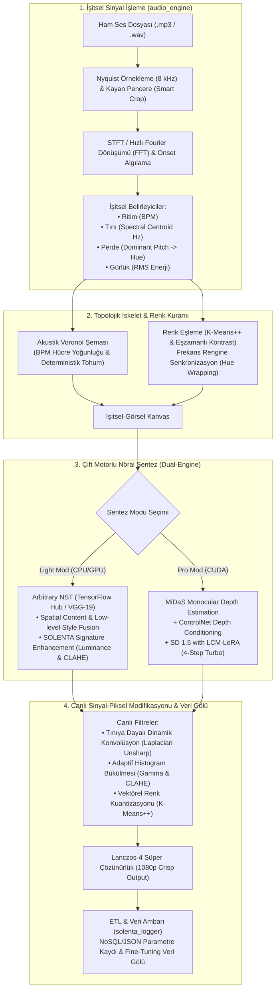

# SOLENTA: Synesthetic Generative Laboratory
### *İşitsel-Görsel Sinestezi ve Üretken Sanat Laboratuvarı*

[](https://www.python.org/)
[](https://pytorch.org/)
[](https://tensorflow.org/)
[](https://gradio.app/)
[](https://opencv.org/)
[](https://librosa.org/)
[-success.svg)](https://github.com/Warkrone34/Solenta)
[](LICENSE)

---

## 📌 Abstract / Proje Özeti

**SOLENTA (Synesthetic Generative Laboratory)**, işitsel sinyalleri (müzik ve ses frekansları) plastik sanat eserleriyle (özellikle Kübist akım) ve yapay görme algoritmalarıyla birleştiren, çok disiplinli (**Multidisciplinary**) bir görüntü işleme ve üretken yapay zeka (**Generative AI**) tez projesidir.

Proje, yalnızca hazır bir difüzyon sarmalayıcısı (wrapper) olmak yerine; **dijital sinyal işleme (DSP)**, **geometrik hesaplamalı topoloji (Voronoi şeması)**, **renk kuramı ve Gestalt algısı (Eşzamanlı Kontrast, K-Means++)** ve **çift motorlu nöral sentez (Neural Style Transfer + ControlNet Depth-to-Image with LCM Turbo)** aşamalarını birbirine bağlayan uçtan uca açıklanabilir (**Explainable / White-Box**) bir bilişsel mimari sunar.

> [!NOTE]
> Bu çalışma, **3 üniversite öğretim üyesinden oluşan tez jürisi (içlerinde Bölüm Başkanı dahil)** onayından geçmiş ve **BA derecesi** ile kabul edilmiştir.

---

## 🏗️ System Architecture / Mimari İş Akışı

Aşağıdaki şema, ham bir ses dosyasının veya kullanıcı görselinin SOLENTA boru hattından geçerek 1080p nihai sanatsal çıktıya dönüşüm serüvenini göstermektedir:



---

## 🔬 Core Engineering & Mathematical Foundations

### 1. İşitsel Sinyal Analizi (`audio_engine.py`)
- **Heuristik Akıllı Kesim (Smart Crop):** 8000 Hz'e indirgenmiş (downsampled) sinyal üzerinde RMS enerjisi ve Onset zarfı matrisel olarak toplanıp kayan pencere (rolling window) konvolüsyonu ile taranır. Şarkının enerjisinin doruğa ulaştığı (kreşendo/drop) saniye otonom tespit edilir.
- **Spektral Tını & Frekans Haritalaması:** STFT ve FFT analizleri ile sesin spektral ağırlık merkezi (Centroid) Hz cinsinden hesaplanır. En yüksek enerjiye sahip dominant perde frekansı $[0, 360^\circ]$ HSV renk silindirine sarılarak (modulo arithmetic) müziğin baskın renk tonu (Hue) saptanır.

### 2. Akustik Voronoi Kanvası (`app.py`)
- Müziğin fiziksel parametreleri bir araya getirilerek deterministik bir tohum (seed) üretilir ($BPM + Timbre + Hue + Loudness$).
- Voronoi poligonlarının sayısı BPM ve gürlük ile orantılı şekilde dinamik belirlenir. Kenar kalınlıkları ve Gaussian analog grenleri gürlük seviyesine göre boyanır.

### 3. Renk Algısı ve Kübist Akım Eşleme (`color_engine.py` & `data_manager.py`)
- **K-Means++:** 100x100 boyutuna indirgenmiş görsel matrisinde $k=3$ kümeleme yapılarak baskın zemin rengi saptanır.
- **Simultaneous Contrast (Eşzamanlı Kontrast):** Gestalt algı kuramına dayanarak tespit edilen zemin renginin insan gözünde oluşturacağı tamamlayıcı renk illüzyonu (sıcaklık/soğuma etkisi) hesaplanır.
- **2D Fourier Görsel Tınısı:** Eserlerin dokusal frekans genliği $\mathcal{F}_{2D}$ dönüşümü ile hesaplanarak müzikal tını ile eşleştirilir.

### 4. Çift Motorlu Hibrit Yapay Zeka (`nst_engine.py` & `diffusion_engine.py`)
- **Light Mod (Mobil/Hafif Sistemler):** Google Magenta Arbitrary Image Stylization modeli üzerinden ileri besleme (Feed-Forward). NST modellerindeki renk solmasını (Color Shift) önlemek adına LAB renk uzayında Luminance korumalı **SOLENTA Signature Enhancement** rötüşü uygulanır.
- **Pro Mod (Yüksek Başarımlı CUDA):** Intel MiDaS ile derinlik haritası (Z-Axis Depth Map) çıkarılır. Stable Diffusion 1.5, ControlNet Depth koşullandırması ve Latent Consistency Model (LCM) LoRA çekirdeği ile 4-6 adımda fotogerçekçi sentez üretir.

---

## 📂 Repository Structure / Dizin Yapısı

```
Solenta/
├── app.py                   # Gradio tabanlı ana orkestrasyon ve arayüz katmanı
├── audio_engine.py          # Librosa tabanlı DSP, STFT, FFT, Smart Crop motoru
├── color_engine.py          # K-Means++ ve Eşzamanlı Kontrast renk analiz motoru
├── data_manager.py          # Veri seti sınıflandırma, 2D-FFT görsel tını eşleme, Safe-IO
├── diffusion_engine.py      # MiDaS Depth + ControlNet + LCM Turbo Pro motoru
├── filter_engine.py         # Laplacian dinamik konvolüsyon & K-Means kuantizasyon
├── nst_engine.py            # Magenta NST (VGG-19) & LAB renk restorasyonu
├── solenta_logger.py        # Deterministik JSON ETL / Data Lake loglama motoru
├── requirements.txt         # Standart ve temiz bağımlılık listesi (UTF-8)
├── LICENSE                  # MIT Açık Kaynak Lisansı
├── .gitignore               # Model, venv, build ve 100MB+ dosyaları süzen filtre
└── dataset/
    ├── analitik/            # Örnek analitik kübist referans eserler
    ├── sentetik/            # Örnek sentetik kübist referans eserler
    ├── proto/               # Örnek proto-kübist referans eserler
    └── audio/               # Hazır test müzikleri (Paganini, Beethoven, Hip-Hop vb.)
```

---

## 🚀 Installation & Quick Start / Kurulum ve Çalıştırma

### 1. Gereksinimler
- **İşletim Sistemi:** Windows 10/11, Linux, macOS
- **Python:** 3.10 veya 3.11 önerilir
- **Donanım:** 
  - *Light Mod:* Herhangi bir modern CPU (veya entegre GPU)
  - *Pro Mod:* En az 6 GB VRAM destekli NVIDIA GPU (CUDA 12+)

### 2. Klonlama ve Sanal Ortam Kurulumu
```bash
# Depoyu klonlayın
git clone https://github.com/Warkrone34/Solenta.git
cd Solenta

# Sanal ortam oluşturup aktive edin
python -m venv venv

# Windows:
venv\Scripts\activate
# Linux/macOS:
source venv/bin/activate
```

### 3. Bağımlılıkların Yüklenmesi
```bash
# Temel kütüphaneleri yükleyin
pip install -r requirements.txt

# (Opsiyonel) Pro Mod için CUDA destekli PyTorch yüklemesi:
pip install torch torchvision --index-url https://download.pytorch.org/whl/cu121
```

### 4. Uygulamayı Başlatma
```bash
python app.py
```
> Sunucu çalıştığında varsayılan tarayıcınızda otomatik olarak `http://127.0.0.1:7860` adresinde açılacaktır.

---

## 🎨 Modes of Operation / Kullanım Modları

| Mod | Girdi Türü | Kullanılan Motor | Açıklama |
| :--- | :--- | :--- | :--- |
| **Müzikten Görsel Üret** | `.mp3` veya `.wav` ses dosyası | Voronoi + NST veya LCM Turbo | Müziğin frekanslarından soyut/figüratif sanat eseri sentezler. |
| **Fotoğrafa Sanat İşle** | Kullanıcı fotoğrafı + Referans Sanat Eseri | MiDaS + ControlNet veya NST | Fotoğrafın mekansal yapısını koruyarak Kübist sanat stilini aktarır. |

---

## 📊 Evaluation & Academic Defense / Akademik Değerlendirme

- **Proje Türü:** Bilgisayar Programcılığı / Bitirme Tezi
- **Akademik Danışman & Katkıda ek katkıda bulunanlar:** *[Danışman Bilgisi / Bölüm Başkanı İsmi - İzin doğrultusunda güncellenecektir]*

---

## 🔭 Future Work & Roadmap / Gelecek Çalışmalar

- [ ] **Multimodal Latent Alignment:** Kural tabanlı (heuristic) BPM-akım eşleşmesinin, **CLAP (Contrastive Language-Audio Pretraining)** ve **CLIP** gömme uzaylarında kosinüs benzerliği ile uçtan uca öğrenilmesi.
- [ ] **Real-time Live Audio Reactive Stream:** Canlı mikrofon akışından anlık FFT alarak video kareleri arası pürüzsüz interpolasyon sağlayan dinamik görselleştirici.
- [ ] **Docker & Cloud Deployment:** HuggingFace Spaces ve Docker imajları ile tek tıkla bulut dağıtımı.

---

## 📄 License / Lisans

Bu proje [MIT Lisansı](LICENSE) altında açık kaynak olarak sunulmaktadır. Eğitim, araştırma ve geliştirme amaçlı kullanıma tamamen açıktır.
