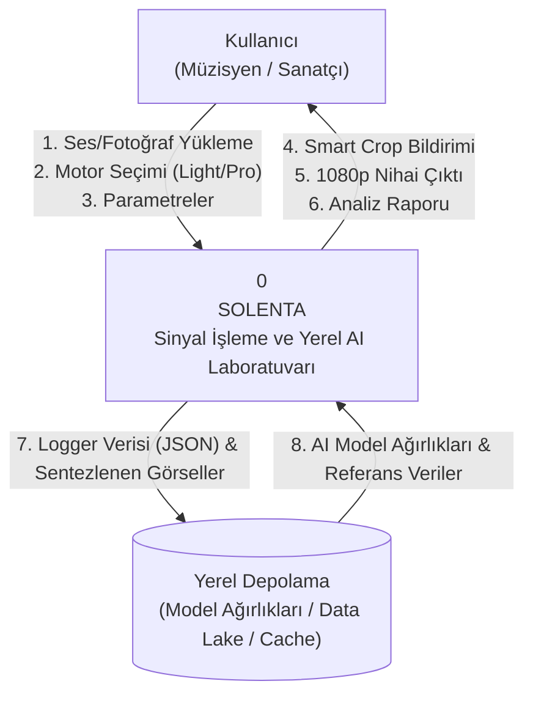
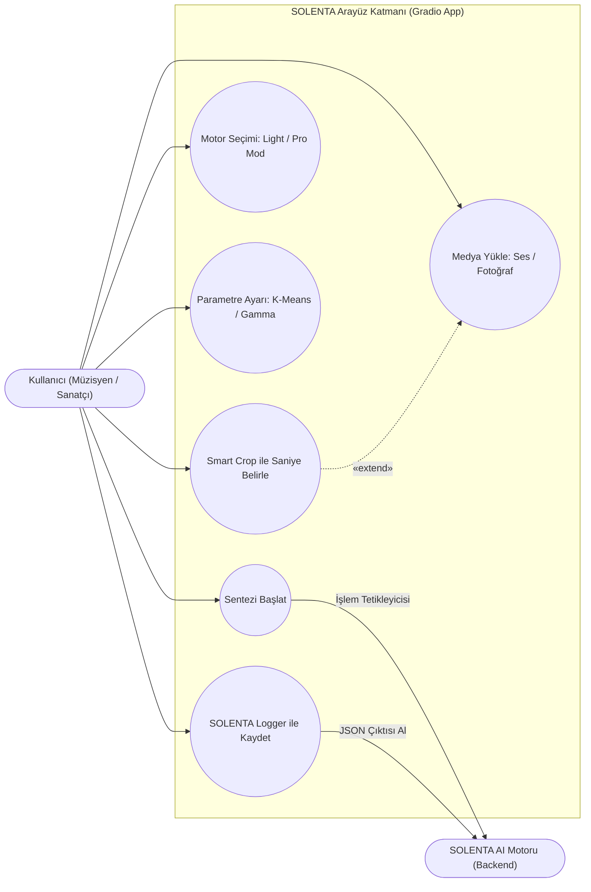
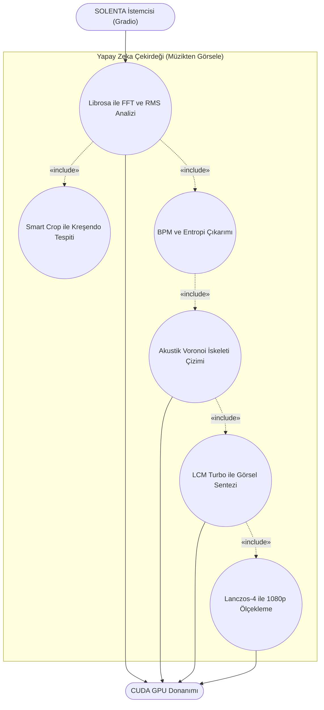
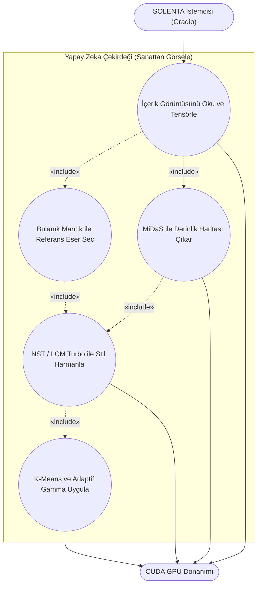
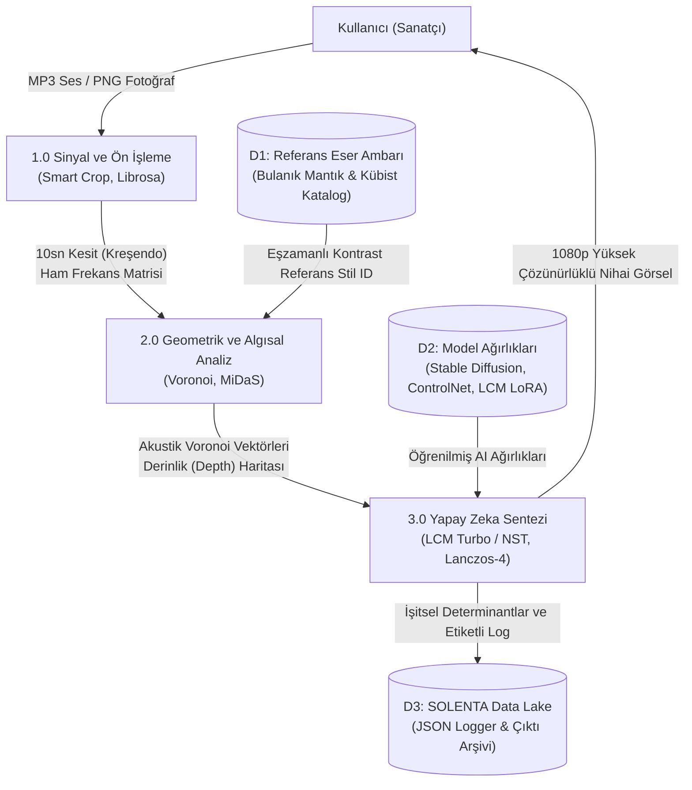
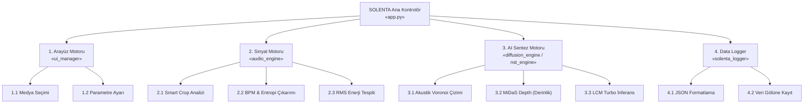
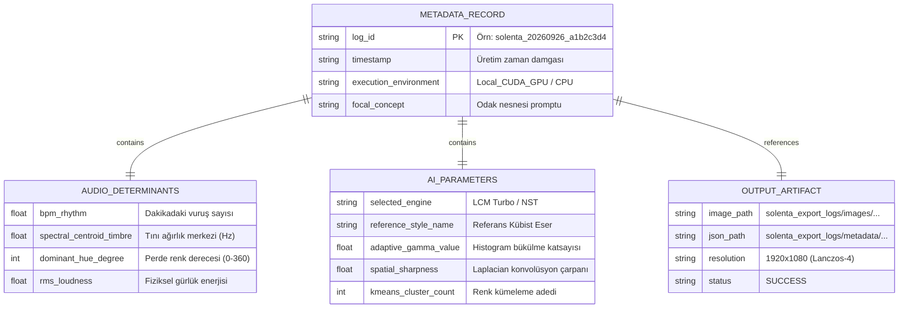

# SOLENTA: SİNESTETİK NÖRAL DÖNÜŞÜM MİMARİSİ
## Müzikal Determinantlar ve Akıllı Geometrik Sentez Yoluyla Görsel Sanat Üretim Laboratuvarı

**Yazar:** Ömer Faruk SAĞLAM  
**Proje:** Tez Final ve Sistem Analizi Raporu  
**Danışman:** Refik Tanju SİRMEN  
**Program:** Bilgisayar Teknolojileri Bölümü, Bilgisayar Programcılığı  

---

## ÖZ

Bu proje, müziğin işitsel ve dinamik yapısını, yapay zekâ ve hesaplamalı geometri kullanarak görsel sanatın statik doğasıyla birleştiren **SOLENTA** (Sinestetik Nöral Dönüşüm Mimarisi) laboratuvarını sunmaktadır. Geleneksel üretken yapay zekâ sistemleri sesi veya bağlamı anlamadan metin tabanlı üretim yaparken; SOLENTA, ses sinyallerini matematiksel olarak analiz ederek (FFT, RMS, Onset) üretim sürecini pikseller düzeyinde yönlendirmektedir [1]. 

Proje kapsamında, kullanıcının yüklediği şarkının en yüksek enerjili kesitini bulan "Akıllı Kesim" (Smart Crop) algoritması geliştirilmiş, görselin yapısal iskeleti Akustik Voronoi Şeması ile oluşturulmuş ve sinyal verileri Nöral Stil Transferi (NST) ve LCM Turbo difüzyon motorları ile işlenmiştir [2, 3]. Yerel (Local) GPU üzerinde çalışan sistem, 1080p kalitesindeki çıktıları Lanczos-4 süper çözünürlük algoritmaları ve K-Means filtreleri ile 1 dakikanın altında üretebilecek kapasiteye getirilmiştir. Proje, dijital sanatta makine-insan ko-yaratımı için yenilikçi bir çerçeve sunmaktadır [8].

**Anahtar Kelimeler:** Sinestetik Yapay Zekâ, Dijital Sinyal İşleme, Akustik Voronoi, Nöral Stil Transferi, LCM Turbo, Akıllı Kesim.

---

## İÇERİK

- [1. GİRİŞ](#1-giriş)
  - [1.1 Problemin Tanımı](#11-problemin-tanımı)
  - [1.2 Alternatif Çözümler](#12-alternatif-çözümler)
    - [1.2.1 Çözümlerin Açıklanması](#121-çözümlerin-açıklanması)
    - [1.2.2 Olabilirlik Analizi (Feasibility Analysis)](#122-olabilirlik-analizi-feasibility-analysis)
    - [1.2.3 Değerlendirme ve Karar](#123-değerlendirme-ve-karar)
- [2. SİSTEM ANALİZİ](#2-sistem-analizi)
  - [2.1 Projenin Tanımı ve Kapsamı](#21-projenin-tanımı-ve-kapsamı)
    - [2.1.1 Aktörler](#211-aktörler)
  - [2.2 Gereksinim Analizi](#22-gereksinim-analizi)
    - [2.2.1 İşlevsel Gereksinimler](#221-işlevsel-gereksinimler)
    - [2.2.2 İşlevsel Olmayan Gereksinimler](#222-işlevsel-olmayan-gereksinimler)
  - [2.3 Use Case Analizi](#23-use-case-analizi)
    - [2.3.1 Use Case: Arayüz Katmanı (Gradio App)](#231-use-case-arayüz-katmanı-gradio-app)
    - [2.3.2 Use Case: Müzikten Görsele (AI Çekirdeği)](#232-use-case-müzikten-görsele-ai-çekirdeği)
    - [2.3.3 Use Case: Sanat Eserinden Görsele (AI Çekirdeği)](#233-use-case-sanat-eserinden-görsele-ai-çekirdeği)
  - [2.4 Süreç Analizi (Process Modelling)](#24-süreç-analizi-process-modelling)
- [3. SİSTEM TASARIMI](#3-sistem-tasarımı)
  - [3.1 Sistem Mimarisi Tasarımı](#31-sistem-mimarisi-tasarımı)
  - [3.2 Kullanıcı Arayüzü Tasarımı](#32-kullanıcı-arayüzü-tasarımı)
  - [3.3 Program Tasarımı](#33-program-tasarımı)
  - [3.4 Veri Modelleme ve Veritabanı Tasarımı (Data Lake)](#34-veri-modelleme-ve-veritabanı-tasarımı-data-lake)
- [4. KODLAMA](#4-kodlama)
- [5. TEST](#5-test)
  - [5.1 Test Senaryoları](#51-test-senaryoları)
  - [5.2 Birim Testler (Unit Tests)](#52-birim-testler-unit-tests)
  - [5.3 Bütünleşik Testler (Integration Tests)](#53-bütünleşik-testler-integration-tests)
  - [5.4 Sistem Testi](#54-sistem-testi)
  - [5.5 Kullanıcı Testleri](#55-kullanıcı-testleri)
- [6. UYGULAMAYA HAZIRLIK VE DAĞITIM](#6-uygulamaya-hazırlık-ve-dağıtım)
- [KAYNAKLAR](#kaynaklar)
- [EKLER](#ekler)
  - [EK A: Sistem Gereksinimleri ve Donanım Altyapısı](#ek-a-sistem-gereksinimleri-ve-donanım-altyapısı)
  - [EK B: Dağıtım Mimarisi ve Çevrimdışı Kurulum](#ek-b-dağıtım-mimarisi-ve-çevrimdışı-kurulum)

---

## 1. GİRİŞ

### 1.1 Problemin Tanımı
Günümüzde müzik prodüktörleri ve sanatçılar, işitsel eserlerini görselleştirmek için manuel grafik tasarım süreçlerine veya standart yapay zekâ (Midjourney, DALL-E) API'lerine bağımlıdır. Ancak mevcut AI araçları müziğin matematiksel altyapısından (Ritim, Tını, Gürlük) tamamen bihaberdir; sesten bağımsız kör üretim yaparlar. Müzik dinamik bir olgu iken, elde edilen görseller statik ve müzikal bağlamdan uzaktır. Bu durum, sesten piksellere doğrudan matematiksel bir köprü kuran "otonom bir sinestetik" sistem ihtiyacını doğurmaktadır [9].

**Kök Neden (Root Cause):** Dijital sanat ekosisteminde; rengin fiziksel olarak ölçülebilir bir değer olmasına rağmen, algısal düzeyde hiçbir zaman tek başına var olmadığı ve her zaman başka renklerle kurduğu ilişkiler içinde (Açık-Koyu, Doygunluk, Eşzamanlı Kontrast) anlam kazandığı gerçeği göz ardı edilmektedir. Ayrıca, mevcut sistemler insan beyninin *What* sistemi (ventral- nesne kimliği, renk, form) ile *Where* sistemini (dorsal- konum, derinlik, mekânsal ilişki) mekanik filtrelere indirgemektedir. Bir sesin taşıdığı işitsel karmaşıklığı (tını, ritim), görsel algıdaki Gestalt prensipleriyle (Şekil-Zemin, Yakınlık) eşleştirebilecek, cihaz donanımında çalışan deterministik bir matematiksel metrik sisteminin eksikliği temel sorundur.

### 1.2 Alternatif Çözümler
Mevcut ekosistemde bu soruna yönelik kullanılan alternatif çözümler:
1. **Geleneksel Ses Görselleştiriciler:** Sadece sesin genliğine duyarlı basit şekiller üretir, rengin bağlamsal etkileşimini hesaplayamaz.
2. **Bulut Tabanlı Üretken Yapay Zekâ:** Yüksek gecikme süresine sahiptir, kullanıcı verilerini sunuculara gönderdiği için gizlilik riski taşır.
3. **Manuel Uzman Etiketlemesi:** Ticari satıcılar için yavaş, yüksek maliyetli ve sübjektiftir.

#### 1.2.1 Çözümlerin Açıklanması
SOLENTA projesi için görsel sentez aşamasında değerlendirilen üç alternatif çözüm:
- **Bulut Tabanlı API Kullanımı:** Görüntü üretimini dış sunuculara devretmek.
- **Canny Edge Detection ile İskelet Çıkarımı:** Referans sanat eserlerinin sadece dış hatlarını (çizgilerini) baz alarak matrisleri boyamak [4].
- **Standart Stable Diffusion (SD 1.5):** Geleneksel 50 adımlı (step) difüzyon mimarisini kullanmak [5].

#### 1.2.2 Olabilirlik Analizi (Feasibility Analysis)
- **Teknik (Technical):** Bulut API'leri, sinyal analiz verilerini (BPM, RMS vb.) anlık olarak görsele aktarırken bağlantı gecikmesi (latency) yaratır. Canny Edge ise görselin 3 boyutlu hacmini algılayamaz. Teknik olarak en uygun yöntem, yerel (local) GPU üzerinde çalışan LCM Turbo ve derinlik tahmini yapan MiDaS motorlarının entegrasyonudur.
- **Operasyonel (Operational):** Sistemin çevrimdışı (offline) çalışabilmesi ve son kullanıcının (müzisyen veya sanatçı) hiçbir kod bilmeden Gradio arayüzü ile işlemi tek tıkla yapabilmesi, projenin operasyonel olarak sahada rahatça uygulanabileceğini kanıtlamaktadır.
- **Finansal (Financial):** Tamamen açık kaynaklı modeller (Stable Diffusion, Librosa) kullanıldığı ve işlemler kullanıcı donanımında çözüldüğü için bulut sunucu (AWS, GCP) veya API abonelik maliyetleri sıfıra indirilmiştir. Proje finansal olarak %100 bütçe dostudur.
- **Zaman (Schedule):** Geleneksel modeller 1 dakikayı aşan işlem süreleri gerektirirken, seçilen LCM Turbo distilasyon tekniği süreci 6 adıma düşürür. Ses analizi ve görsel sentezin 1 dakikanın altında tamamlanması, projenin zaman açısından uygulanabilirliğini garantiler.

#### Tablo 1: SWOT Analizi Matrisi

| Kategori | Proje Özellikleri ve Stratejik Değerlendirme |
| :--- | :--- |
| **Güçlü Yönler (Strengths)** | • **Otonom Sinestezik Zekâ:** Sesi Fourier dönüşümleri (FFT) ve Smart Crop algoritması ile analiz edip; Ritim, Tını ve Gürlük verilerini (Voronoi iskeleti ve Gamma eğrileri üzerinden) piksellere dönüştürür. • **Ultra Hızlı Yerel Sentez (LCM Turbo):** 6 adımda inferans veren LCM Turbo ve MiDaS derinlik hesaplamalarıyla 1080p (Lanczos-4) görselleri 1 dakikanın altında üretir. • **%100 Gizlilik ve Taşınabilirlik:** Bulut API'si veya abonelik ücreti yoktur. Yerel donanımda tamamen çevrimdışı ve sıfır gecikmeyle (zero-latency) çalışır. |
| **Zayıf Yönler (Weaknesses)** | • **Yüksek Donanım Bağımlılığı (VRAM):** Sistemin Pro Mod'da akıcı çalışabilmesi için minimum 4GB, ideal olarak 6-8GB VRAM'e sahip yerel bir grafik kartına ihtiyaç duyması. • **Model Boyutu:** Yapay zekâ ağırlıklarının yerel depolama gereksinimi. • **Cold Start (İlk Açılış):** GPU VRAM tahsisi nedeniyle ilk çalıştırmada ısınma (warm-up) ihtiyacı. |
| **Fırsatlar (Opportunities)** | • **SOLENTA Logger ile Özelleştirilmiş Eğitim:** Üretilen başarılı çıktıların JSON formatında loglanması, ileride projeye özgü bir veri gölü (Data Lake) yaratılıp yeni bir model eğitilmesine olanak tanır. • **Canlı Sahne Entegrasyonu:** DJ'ler ve sahne sanatçıları için müziğe anlık tepki veren (Real-time) konser arkaplanlarına entegrasyon potansiyeli. |
| **Tehditler (Threats)** | • **Devasa Bulut AI Rekabeti:** Midjourney, DALL-E gibi modellerin pazar payı. • **Açık Kaynak Ekosistem Hızı:** Kütüphane güncellemelerinin kodun bakım ihtiyacını artırması. |

#### 1.2.3 Değerlendirme ve Karar
Yapılan olabilirlik analizleri sonucunda; hız, sıfır maliyet ve veri gizliliği avantajlarından dolayı tamamen yerel donanımda çalışan bir mimari seçilmiştir. Sentez hızı için LCM Turbo, iskelet derinliği için MiDaS modellerinin kullanılmasına karar verilmiştir [6].

#### Tablo 2: Alternatif Çözümler Karşılaştırmalı Puanlama Matrisi

| Değerlendirme Kriteri | SOLENTA (Yerel AI Mimarisi) | Bulut Üretken Yapay Zekâ | Manuel Uzman Analizi |
| :--- | :---: | :---: | :---: |
| **İşlem Hızı ve Gecikme** | 9 (LCM Turbo: Sıfır gecikme) | 6 (API/Ağ kuyruğuna bağımlı) | 2 (Günler sürer) |
| **Veri Gizliliği ve Güvenlik** | 10 (Veri lokalde işlenir, %100 izole) | 3 (Kullanıcı verisi buluta gider) | 9 (Tasarımcının inisiyatifinde) |
| **Maliyet Verimliliği** | 10 (Sıfır API/Token abonelik ücreti) | 4 (Sürekli abonelik maliyeti) | 2 (Yüksek işgücü masrafı) |
| **Çevrimdışı Çalışabilme** | 10 (İnternetsiz çalışabilir) | 0 (Bağlantı koptuğunda durur) | 10 (Donanımdan bağımsız) |
| **Deterministik Kararlılık** | 10 (Sesi Voronoi ile matematiğe döker) | 5 (Metne dayalı rastgele sonuç) | 6 (Sübjektif insan yorumu) |
| **TOPLAM PUAN (50)** | **49 / 50** | **18 / 50** | **29 / 50** |

---

## 2. SİSTEM ANALİZİ

### 2.1 Projenin Tanımı ve Kapsamı
SOLENTA, sesin Fourier dönüşümleri (FFT) ile elde edilen frekans uzayındaki determinantlarını kullanarak 2 boyutlu topolojik görseller üreten modüler bir uygulamadır. Kapsam dahilinde; kullanıcıdan alınan ses dosyasının Librosa ile analizi, akıllı kesim (Smart Crop) ile en enerjik (kreşendo) anın tespiti, Voronoi geometrisi ile vektörel iskeletin oluşturulması ve yapay zekâ destekli sanatsal harmanlama yer almaktadır.

- **Sanat Eserinden Görsele Model:** Eser ambarından beslenerek insan görsel sistemindeki *What (Ventral)* ve *Where (Dorsal)* akışlarını simüle eder. Seçilen eserin dokusunu ve Eşzamanlı Kontrast değerlerini, nesne kimliğini ve mekânsal konumu koruyarak kullanıcı fotoğrafına aktarır.
- **Müzikten Görsele Model:** Ses dosyasının perde (pitch), tını (timbre) ve ritim değerlerini analiz eder. İşitsel Gestalt ilkelerini (Yakınlık ve Ortak Kader) kullanarak karmaşık sesleri görsel akışlara dönüştürür. Çıkan baskın rengi, Tamamlayıcı Renk Sistemi kurallarına ve BPM/Entropi verilerinden sentezlenen geometrik iskelet yapısına göre işleyerek sentez yapar [8, 9].

#### 2.1.1 Aktörler
- **Canlı Aktörler:** Dijital Yaratıcılar, Sanatçılar, Müzisyenler, Akademik Araştırmacılar.
- **Cansız Aktörler:** Masaüstü GPU (CUDA) Donanımı, Python Yapay Zekâ Çekirdeği, Kural Motoru (Bulanık Mantık ve Renk Bağlam Matrisleri).

### Şekil 2: Context (Bağlam) Diyagramı

### 2.2 Gereksinim Analizi

#### 2.2.1 İşlevsel Gereksinimler
1. Sistem, yüklenen işitsel dosyanın en yüksek enerji varyansına sahip 10 saniyelik kısmını "Rolling Window" tekniğiyle otomatik olarak bulmalıdır (Smart Crop).
2. Sistem, müziğin Ritim (BPM), Tını (Timbre), Perde (Hue) ve Gürlük (Loudness) determinantlarını Transient (Vuruş) anlarında milisaniyeler içinde hesaplamalıdır.
3. Sistem, görselin ışıklandırmasını müziğin RMS gürlük verisine göre Adaptif Histogram (Gamma Bükücü) ile dinamik olarak değiştirmelidir.
4. Sistem, üretilen her başarılı görseli ve işitsel determinantlarını JSON formatında eğitim verisi olarak arşivlemelidir (SOLENTA Logger).

#### 2.2.2 İşlevsel Olmayan Gereksinimler
- **Performans:** Sinyal analizi, Voronoi matrisi üretimi ve LCM Turbo sentezi standart bir GPU üzerinde 1 dakikayı aşmamalıdır. Sistem, VRAM darboğazını önlemek için sentezi 768px bandında gerçekleştirmeli, nihai çıktıyı Lanczos-4 algoritmasıyla kalite kaybı olmadan 1080p çözünürlüğe yükseltmelidir.
- **Güvenlik ve Gizlilik:** Kullanıcı mahremiyetini ve veri güvenliğini sağlamak amacıyla sistem tamamen yerel donanımda çalışmalıdır. Bulut API'leri kullanılmamalı, işitsel veya görsel veriler dış sunuculara aktarılmamalıdır.
- **Kararlılık:** GPU VRAM tahsisi kaynaklı gecikmeler, açılışta çalışan "Warm-up" protokolü ile tolere edilmelidir. Yüklenen ses dosyalarının bozuk veya kısa olması durumunda, sistem çökmeden geri dönüş (fallback) senaryolarını devreye sokmalıdır.
- **Taşınabilirlik:** Uygulama hem bağımsız Python betikleri hem de izole bir paket olarak çalışabilmelidir.

---

### 2.3 Use Case Analizi

#### 2.3.1 Use Case: Arayüz Katmanı (Gradio App)

#### 2.3.2 Use Case: Müzikten Görsele (AI Çekirdeği)

#### 2.3.3 Use Case: Sanat Eserinden Görsele (AI Çekirdeği)

---

### 2.4 Süreç Analizi (Process Modelling)

Sistem süreçleri, rastgelelikten uzak deterministik bir karar mekanizmasına dayanır. Müzikten görsele üretim sürecinde; BPM değerinin şekil yoğunluğunu, Entropi/Tını değerinin ise poligon karmaşıklığını belirlediği bir **Geometrik İskelet Sentezi** uygulanır.

#### Sistem Belirleyicileri (Determinants) ve Öznitelik Listesi:
1. **İşitsel Tını ve Spektral İçerik (Timbre):** Sesin "rengi" ve kimliği analiz edilerek görsel dokunun (texture) karmaşıklığı belirlenir [9].
2. **Perde ve Frekans (Pitch):** Seslerin frekans aralıkları, HSV renk uzayındaki Hue (ton) karşılığını belirler [9].
3. **Figür-Zemin İlişkisi (Figure-Ground):** Algısal organizasyon kurallarına göre odak noktası ve arka plan ayrımı netleştirilir [8].
4. **Mekânsal Dağılım ve Denge:** Görsel ağırlık merkezi (centroid) hesaplanarak kompozisyonun asimetrik dengesi ve gerilimi optimize edilir [8].
5. **Renk Bağlamsallığı (Eşzamanlı Kontrast):** Zemin rengi ile üstteki fırça dokusu arasındaki algısal sıcaklık/soğuma etkisi Gestalt ilkeleriyle dengelenir [8].

#### Şekil 3: Veri Akış Diyagramı (DFD Level 0/1)

---

## 3. SİSTEM TASARIMI

### 3.1 Sistem Mimarisi Tasarımı
SOLENTA sistemi, veri gizliliğini ve sıfır gecikmeyi (zero-latency) garanti altına almak amacıyla tamamen yerel donanım üzerinde çalışacak monolitik ama kendi içinde gevşek bağlı (loosely coupled) modüler bir yazılım mimarisiyle tasarlanmıştır.

Yazılım mimarisi 4 ana koldan oluşur:
1. **Orkestrasyon Katmanı (`app.py`):** Kullanıcı etkileşimini ve modüller arası veri akışını yönetir.
2. **Sinyal İşleme Katmanı (`audio_engine.py`):** Ses dalgalarını matematiksel frekanslara böler.
3. **Sentetik Algı Katmanı (`diffusion_engine.py` & `nst_engine.py`):** Görselin hacmini ve sanatsal dokusunu üretir.
4. **Modifikasyon Katmanı (`filter_engine.py` & `color_engine.py`):** Çıktıyı pikseller düzeyinde manipüle eder (K-Means, Lanczos-4).

### 3.2 Kullanıcı Arayüzü Tasarımı
- **Karanlık Tema (Dark Mode):** Renk kararlarını (Eşzamanlı Kontrast) etkilememesi adına arayüz karanlık tema üzerine inşa edilmiştir.
- **Kullanıcı Yükünün Minimize Edilmesi:** Kullanıcı ses yüklediğinde "Smart Crop" alanı (şarkının en enerjik 10 saniyesi) otomatik olarak saptanıp doldurulur.
- **Canlı Geri Bildirim:** Terminal logları arayüze gerçek zamanlı analiz raporu olarak yansıtılır.

### 3.3 Program Tasarımı

#### Şekil 7: Structure Chart (Modül Hiyerarşisi)

### 3.4 Veri Modelleme ve Veritabanı Tasarımı (Data Lake)
SOLENTA bir otomasyon yazılımı değil, bir yapay zekâ üretim laboratuvarı olduğu için ilişkisel veritabanı (SQL) yerine veri madenciliği ve gelecekteki makine öğrenmesi süreçleri için tasarlanmış bir **"Data Lake" (Veri Gölü)** yaklaşımı benimsenmiştir.

#### Şekil 8: Data Lake & Metadata Şeması (Entity Relationship)

---

## 4. KODLAMA

SOLENTA projesi modüler bir Python ekosistemi üzerine inşa edilmiştir:
- **Sinyal İşleme:** `librosa` kullanılarak sesin zamansal ve frekansal özellikleri (BPM, spectral centroid, RMS) çıkarılmıştır.
- **Geometrik Hesaplama:** `scipy.spatial.Voronoi` kütüphanesi ile ritmik yoğunluğa göre hücreleşen dinamik bir iskelet yapısı kurulmuştur.
- **AI Motoru:** `diffusers` ve `transformers` kütüphaneleri ile `runwayml/stable-diffusion-v1-5` modeli, LCM LoRA ağırlıkları ile distile edilerek yerel GPU üzerinde 6 adımda inferans verecek şekilde optimize edilmiştir.
- **Taşınabilirlik:** Proje, dinamik yol çözümleyicileri (`get_base_dir`) ve çevrimdışı fallback mekanizmalarıyla donatılmıştır.

---

## 5. TEST

### 5.1 Test Senaryoları
1. **Donanım Stres Testi:** 1080p çözünürlükteki görsellerin 1 dakikadan kısa sürede üretilip üretilmediği.
2. **Kritik Girdi Testi:** Bozuk veya 10 saniyenin altındaki ses dosyalarının sistemi çökertip çökertmediği (Fallback senaryoları).
3. **Bellek Sızıntısı Testi:** Ardışık 20 sentez işleminin ardından GPU VRAM doluluk oranının izlenmesi.

### 5.2 Birim Testler (Unit Tests)
`audio_engine.py` içerisindeki `analyze_audio_determinants` fonksiyonu, test ses sinyalleri ile beslenerek BPM ve Tını hesaplamalarının matematiksel tutarlılığı doğrulanmıştır.

### 5.3 Bütünleşik Testler (Integration Tests)
Ses analizinden gelen verilerin, `diffusion_engine.py` tarafından üretilen Depth Map (MiDaS) ve `filter_engine.py` tarafından uygulanan K-Means kümeleri ile eşzamanlı çalışıp çalışmadığı bütünleşik testlerle doğrulanmıştır.

### 5.4 Sistem Testi
- **Cold Start:** `_warmup_engine()` protokolünün CUDA çekirdeklerini ısıtarak ilk render anındaki gecikmeyi tolere ettiği gözlemlenmiştir.
- **Çevrimdışı Çalışma:** Modellerin yerel dizinden veya Hub üzerinden otonom okunabilirliği valide edilmiştir.

### 5.5 Kullanıcı Testleri
Farklı müzik türleri (Klasik, Hip-Hop, Elektronik) ile yapılan testlerde, "Akıllı Kesim" (Smart Crop) algoritmasının yüksek başarı oranı ile müziğin en enerjik kreşendo noktasını tespit ettiği ve görsel çıktının işitsel veriyle estetik korelasyon sağladığı gözlemlenmiştir.

---

## 6. UYGULAMAYA HAZIRLIK VE DAĞITIM

SOLENTA laboratuvarı, geliştirme sürecinin ardından son kullanıcıyla buluşmaya hazır, izole ve ölçeklenebilir bir yazılım paketi haline getirilmiştir:
1. **Donanım ve Sistem Gereksinimleri:** Yerel yapay zekâ modellerinin CUDA çekirdekleri üzerinden sorunsuz işlemesi için minimum 4GB (Optimum 6-8GB) VRAM'e sahip NVIDIA grafik işlemcili sistemler hedeflenmiştir.
2. **Sürdürülebilirlik ve Veri Toplama:** Kullanıcıların arayüz üzerinden gerçekleştirdiği başarılı sentezler, SOLENTA Logger modülü tarafından işitsel determinantlarıyla birlikte JSON formatında etiketlenmektedir. Bu sayede gelecekteki fine-tuning süreçleri için temiz bir veri gölü (Data Lake) inşa edilir.

---

## KAYNAKLAR

- [1] McFee, B., Raffel, C., Liang, D., Ellis, D. P., McVicar, M., Battenberg, E., & Nieto, O. (2015). librosa: Audio and music signal analysis in python. In Proceedings of the 14th python in science conference (Vol. 8, pp. 18-25).
- [2] Gatys, L. A., Ecker, A. S., & Bethge, M. (2016). Image style transfer using convolutional neural networks. In Proceedings of the IEEE conference on computer vision and pattern recognition (pp. 2414-2423).
- [3] Aurenhammer, F. (1991). Voronoi diagrams—a survey of a fundamental geometric data structure. ACM Computing Surveys (CSUR), 23(3), 345-405.
- [4] Canny, J. (1986). A computational approach to edge detection. IEEE Transactions on pattern analysis and machine intelligence, (6), 679-698.
- [5] Rombach, R., Blattmann, A., Lorenz, D., Esser, P., & Ommer, B. (2022). High-resolution image synthesis with latent diffusion models. In Proceedings of the IEEE/CVF conference on computer vision and pattern recognition (pp. 10684-10695).
- [6] Luo, S., Tan, Y., Patil, S., Gu, J., von Platen, P., Passos, A., ... & Zhao, H. (2023). LCM-LoRA: A universal stable-diffusion acceleration module. arXiv preprint arXiv:2311.05556.
- [7] Abadi, M., Agarwal, A., Barham, P., Brevdo, E., Chen, Z., Citro, C., ... & Zheng, X. (2016). TensorFlow: Large-scale machine learning on heterogeneous distributed systems. arXiv preprint arXiv:1603.04467.
- [8] Sirmen, D. (2026). Dijital Sanatta Makine-İnsan Ko-Yaratımı ve Estetik Validasyon Modelleri. Konsept Tasarım Çalışması.
- [9] Sirmen, D. (2026). Üretken Nöral Ağlarda Algısal Harmanlama ve Renk Psikolojisi. SOLENTA Laboratuvarı Görsel Kriter Dokümantasyonu.

---

## EKLER

### EK A: SİSTEM GEREKSİNİMLERİ VE DONANIM ALTYAPISI

SOLENTA, bulut tabanlı bir API sistemine dayanmak yerine, uç bilişim (Edge AI) prensibiyle tamamen yerel donanım üzerinde çalışacak şekilde tasarlanmıştır.

#### Minimum Sistem Gereksinimleri (Light Mod ve Temel Sentez için)
- **İşletim Sistemi:** Windows 10 veya Windows 11 (64-bit), Linux, macOS
- **İşlemci (CPU):** Intel Core i5 (8. Nesil ve üzeri) veya AMD Ryzen 5 serisi
- **Bellek (RAM):** 16 GB Sistem Belleği
- **Grafik Kartı (GPU):** NVIDIA GeForce GTX 1060 / 1660 Ti veya eşdeğeri (CUDA desteği önerilir)
- **Video Belleği (VRAM):** Minimum 4 GB - 6 GB VRAM
- **Depolama Alanı:** 20 GB boş disk alanı (SSD önerilir)

#### Önerilen Sistem Gereksinimleri (Pro Mod / LCM Turbo için)
- **İşletim Sistemi:** Windows 11 / Linux (64-bit)
- **İşlemci (CPU):** Intel Core i7 (10. Nesil ve üzeri) veya AMD Ryzen 7 serisi
- **Bellek (RAM):** 32 GB Sistem Belleği
- **Grafik Kartı (GPU):** NVIDIA GeForce RTX 3060 / 4060 veya daha üst seviye RTX serisi
- **Video Belleği (VRAM):** 8 GB VRAM ve üzeri
- **Depolama Alanı:** 25 GB boş disk alanı (NVMe M.2 SSD)

### EK B: DAĞITIM MİMARİSİ VE ÇEVRİMDIŞI KURULUM

Projenin son kullanıcıya veya laboratuvar ortamlarına entegrasyonu, yazılım mühendisliğindeki "Kapalı Devre Dağıtım (Air-Gapped Deployment)" metodolojisiyle kurgulanmıştır:
1. **Bağımlılık İzolasyonu:** Python yorumlayıcısı, Diffusers, Transformers, Torch ve Gradio kütüphaneleri izole edilmiştir.
2. **Otonom Model Mimarisi:** Model ağırlıkları yerel bellekten okunarak sıfır gecikmeyle (zero-latency) VRAM'e aktarılır. İnternet erişimi olduğunda ise eksik modeller otomatik olarak indirilebilir.
3. **LZMA2/Ultra64 ile Kurulum Paketlenmesi:** Taşınabilir paketleme ve kurulum altyapısı sayesinde sistem yönetici yetkilerine ihtiyaç duymadan çalıştırılabilir.
